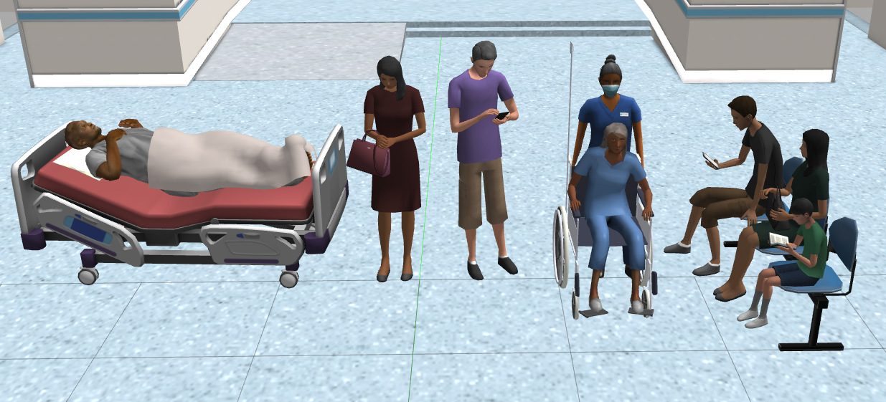

# attention-l4ros2

## Description

In this task, the robot will focus its attention to the specified models of the [aws hospital world](https://github.com/aws-robotics/aws-robomaker-hospital-world#readme) in perimeter of 1 meter.
In order to do it, a knowledge base will be used, specifically the [ros2_knowledge_graph](https://github.com/fmrico/ros2_knowledge_graph).

## How to run

To launch the world and spawn tiago:

    ros2 launch attention_l4ros2 attention_hospital_launch.py

To launch our attention nodes:

    ros2 launch attention_l4ros2 attentio_launch.py

## Plugin

To check the coordinates of the models in the world, we will make use of this plugin:

    <plugin name="gazebo_ros_state" filename="libgazebo_ros_state.so">
        <ros>
            <namespace>/gazebo</namespace>
        </ros>
        <update_rate>1.0</update_rate>
    </plugin>

These \<plugin> tag need to be inside the \<world> tag.

This was used to make it easier and focus on the attention programming.

We can check that the plugin is correctly working by executing this command that makes use of the service that the plugin provides:

    ros2 service call /gazebo/get_entity_state gazebo_msgs/srv/GetEntityState '{name: 'BPCart_3::BPCart::body', reference_frame: 'tiago::base_footprint'}'

In this case we are getting the state of the model "BPCart_3" with respect to tiago.

## Models to pay attention

Tiago will be paying attention to people, here we can se some of these models:

## Using the knowledge graph

<TODO>

## Video demostration:

https://urjc-my.sharepoint.com/:v:/g/personal/j_delacanoniga_2019_alumnos_urjc_es/EQ832Yc7EPNNtHagO4fbY58BlZtLx9yMhTNk6_tJvPrLtg?e=AljKwP

## Authors

 - Javier de la Canóniga: @javi-dbgr
 - Iván López: @ivrolan
 - Alejandro Moncalvillo: @Amglega
 - Unai Sanz: @USanz

